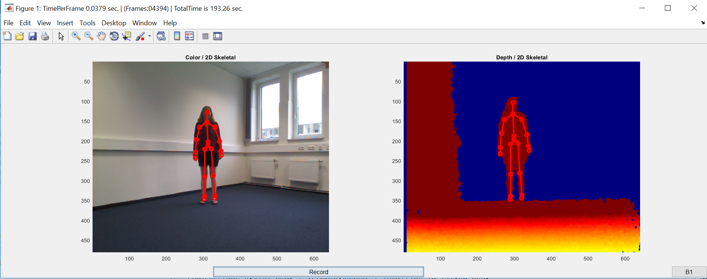
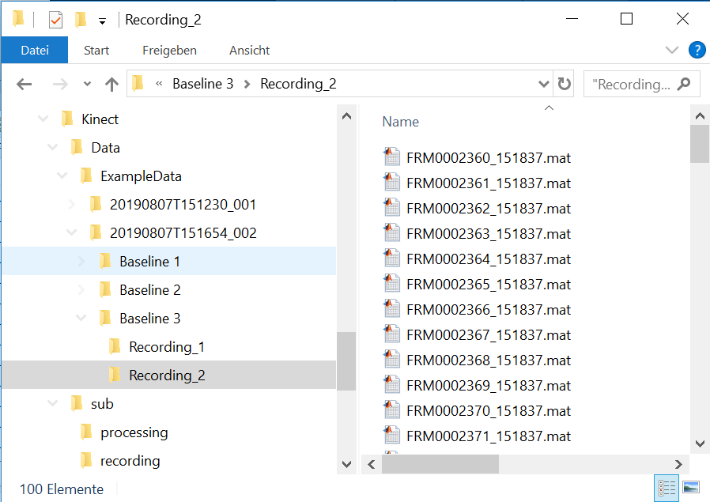
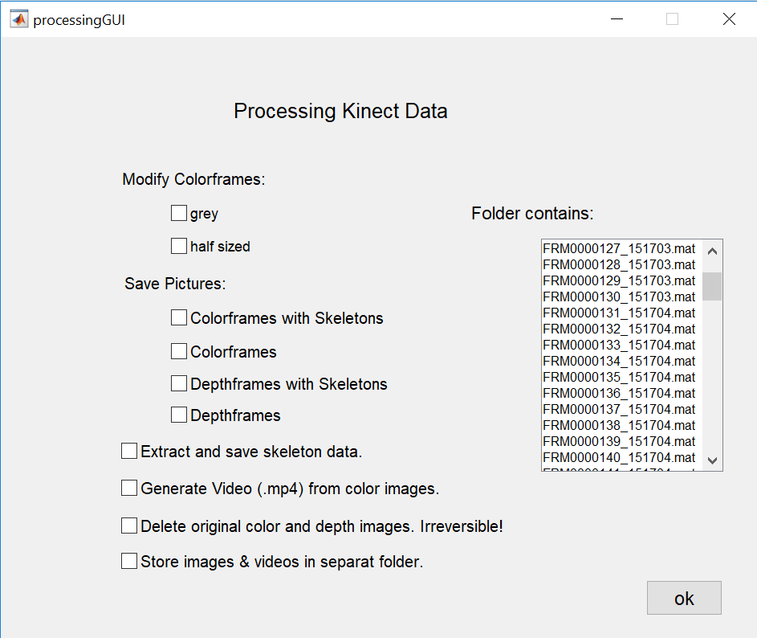

# Kinect - body posture analysis

This repository contains all relevant scripts to run, process, and analyze posture data from Kinect studies.
Each script is named after the processing step it reflects in the overall process.

## Getting Started

### Prerequisites

__Compatibility__:

- The Recording Script runs __only__ with Windows due to compatibility with the Kinect.
- These scripts are written for use with the Kinect for Windows v1 (Model 1517). Due to limitations of the hardware support the Kinect for Xbox 360 is __not__ suitable.

__Installation instructions__:

- Download and install Matlab including the Image Acquisition Toolbox and the Image Processing Toolbox. <br/>
In order to check if the Image Acquisition Toolbox is installed navigate to the Add-On Manager in MATLAB (Home tab - Add-Ons - Manage Add-Ons) or type the following code in the MATLAB command window:

```Matlab
license('test', 'Image_Acquisition_Toolbox')
```
- In addition the following hardware support is necessary: [Image Acquisition Toolbox Support Package for Kinect for Windows Sensor](https://de.mathworks.com/hardware-support/kinect-windows.html). For further information and to download the package navigate to the Add-On Explorer in MATLAB (Home tab - Add-Ons - Get Hardware Support Packages) and search for the package or follow the link above.
  - requires:
    - MATLAB compatibility: R2013a and later; with
      - Image Acquisition Toolbox
      - Image Processing Toolbox
  - platform compatibility: Windows (MATLAB R2016a or later only for Windows 64-Bit)
  - Third-Party requirements: [Kinect for Windows Runtime v1.6](https://www.microsoft.com/en-us/download/details.aspx?id=34811); should get installed by the hardware support package

The Processing Script runs on Windows and Mac OS (and Linux?)
- requires: MATLAB (Version compatibility)

## Usage

### Step 1 - recording
Collect data by using the recording script.

To use the recording script the Kinect should already be connected to your computer via a USB-port. <br/>
Once the script is executed a command line input of the study name and subsequently the subject name will be requested. Afterwards, the recording GUI (see the image below), continuously showing the the camera input, pops up.
-  By pressing the "Record" button the recording could be started and stopped.
- By pressing the button in the right corner a new folder below the subject folder level will be generated.



<br/>

For further information concerning options and usage see the preamble of the recording script [(RecordOneKinect.m)](https://github.com/rhepach/Kinect/blob/master/RecordOneKinect.m).

### Step 2 - processing
Run the MATLAB processing script to extract body posture information and images from the .mat files for each frame or delete data to reduce the .mat file size.

In order to use the processing script, it is necessary to specify the directory to the study data folder. The structure below the indicated folder should comprise three levels.
1. The first level should be the subject level with one folder for each subject.
2. Each subject folder comprises Baseline/Test folders ...
3. ... in which the Recording folders with the single .mat frame files should be stored.

Note that the required subfunctions should be located in the folder "processing" which is a subfolder of "sub".

See the image below for an illustrative folder structure.
<br/>



<br/>

Once you run the script a window will pop up - the processing GUI (see the image below).
- By ticking the individual checkboxes the corresponding processing will be executed as soon as the ok button will be pressed.
- The listbox on the right-hand side of the GUI could be used to browse through the content of the folders. Selecting a folder inside the listbox won't change the indicated folder with the data to be processed.



## Support

If you are experiencing issues installing the hardware, or running the scripts, please contact <br/>
robert.hepach@uni-leipzig.de or <br/>
stella.gerdemann@uni-leipzig.de or <br/>
ks56cyvu@studserv.uni.leipzig.de

## Roadmap
list ideas for releases in the future.

## Contributing

The processing script is part of an ongoing line of research and it is continuously updated. Those familiar with Matlab will notice redundancies in the code and room for improvement. <br/>
Pull requests are welcome. You are, of course, free to make changes to the script for your own purposes but you do so at your own risk.
For major changes, please open an issue first to discuss what you would like to change.

## Authors and acknowledgment
Processing Script:
- written by Anja Neumann.
- maintained by Robert Hepach, Stella Gerdemann, Kim-Laura Speck.

Recording Script:
- written by Anja Neumann.
- maintained by Robert Hepach.

If you use the script or find it generally useful kindly support our research by citing our work.
-  Hepach, R., Vaish, A., & Tomasello, M. (2015). Novel paradigms to measure variability of behavior in early childhood: posture, gaze, and pupil dilation. _Frontiers in psychology, 6_, 858. [https://doi.org/10.3389/fpsyg.2015.00858](https://doi.org/10.3389/fpsyg.2015.00858)
- Hepach, R., Vaish, A., & Tomasello, M. (2017). The fulfillment of others’ needs elevates children’s body posture. _Developmental psychology, 53(1)_, 100. [http://dx.doi.org/10.1037/dev0000173](http://dx.doi.org/10.1037/dev0000173)
