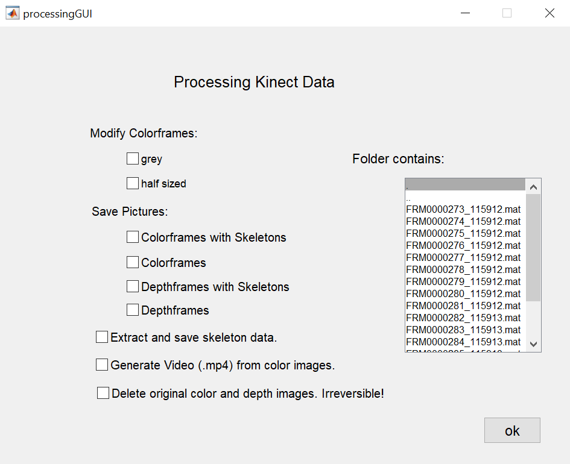

# Kinect - body posture analysis

One Paragraph of project description goes here. 

Contains all relevant scripts to run, process, and analyze posture data from Kinect studies.
Each script is named after the processing step it reflects in the overall process.

## Getting Started

### Prerequisites


Compatibility: 
- The Recording Script runs on only with Windows due to compatibility with the Kinect.
- These scripts are written for use with the Kinect V1 (vielleicht ein link dazu - stimmt das? Es gibt ja auch außer der Kinect v1 noch die v2). Due to limitations of the hardware support Kinect for Xbox 360 is not suitable. 

Installation instructions: 

- Download and install Matlab including the Image Acquisition Toolbox
In order to check if the Image Acquisition Toolbox is installed type the following code in the MATLAB command window: 

```Matlab
license('test', 'Image_Acquisition_Toolbox')
```
The following hardware support is needed: Image Acquisition Toolbox Support Package for Kinect for Windows Sensor. For further information see: [Hardware support for kinect in windows.](https://de.mathworks.com/hardware-support/kinect-windows.html)
- requires:
  - Image Acquisition Toolbox
  - Image Processing Toolbox (heißt das man muss die Image Processing Toolbox bei Matlab installiert haben?)
- MATLAB compatibility: R2014a to R2019a
- platform compatibility: Windows


The Processing Script runs on Windows and Mac OS (and Linux?)
- requires: 
  - Image Acquisition Toolbox? 


## Usage

### Step 1
Collect data by using the recording script.
Vielleicht könnten die Instruktionen hier noch genauer sein? Vielleicht ein screenshot des Recording-skripts mit Instruktionen, wie es angepasst werden m bevor die Aufnahme gestartet wird.  

### Step 2
Using the .mat files for each frame, run the MATLAB processing script to extract body posture information, images or delete data to reduce file size.

Vielleicht wäre hier auch ein Screenshot davon wo die Daten liegen und wie sie eingelesen werden können hilfreich? 


The image below shows the processing GUI with all options to chose for processing the data.



## Support
If you are experiencing issues installing the hardware, or running the scripts, please contact
robert.hepach@uni-leipzig.de or 
stella.gerdemann@uni-leipzig.de und Kim? 
## Roadmap
list ideas for releases in the future.

## Contributing
State if you are open to contributions and what your requirements are for accepting them.

The processing script is part of an ongoing line of research and it is continuously updated. Those familiar with Matlab will notice redundancies in the code and room for improvement.

Pull requests are welcome. You are, of course, free to make changes to the script for your own purposes but you do so at your own risk.
For major changes, please open an issue first to discuss what you would like to change.

## Authors and acknowledgment
Processing Script:
- written by Anja Neumann.
- maintained by Robert Hepach.

Recording Script:
- written by Anja Neumann.
- maintained by Robert Hepach.

If you use the script or find it generally useful kindly support our research by citing our work.
-  Hepach, R., Vaish, A., & Tomasello, M. (2015). Novel paradigms to measure variability of behavior in early childhood: posture, gaze, and pupil dilation. _Frontiers in psychology, 6_, 858. [https://doi.org/10.3389/fpsyg.2015.00858](https://doi.org/10.3389/fpsyg.2015.00858)
- Hepach, R., Vaish, A., & Tomasello, M. (2017). The fulfillment of others’ needs elevates children’s body posture. _Developmental psychology, 53(1)_, 100. [http://dx.doi.org/10.1037/dev0000173](http://dx.doi.org/10.1037/dev0000173)
